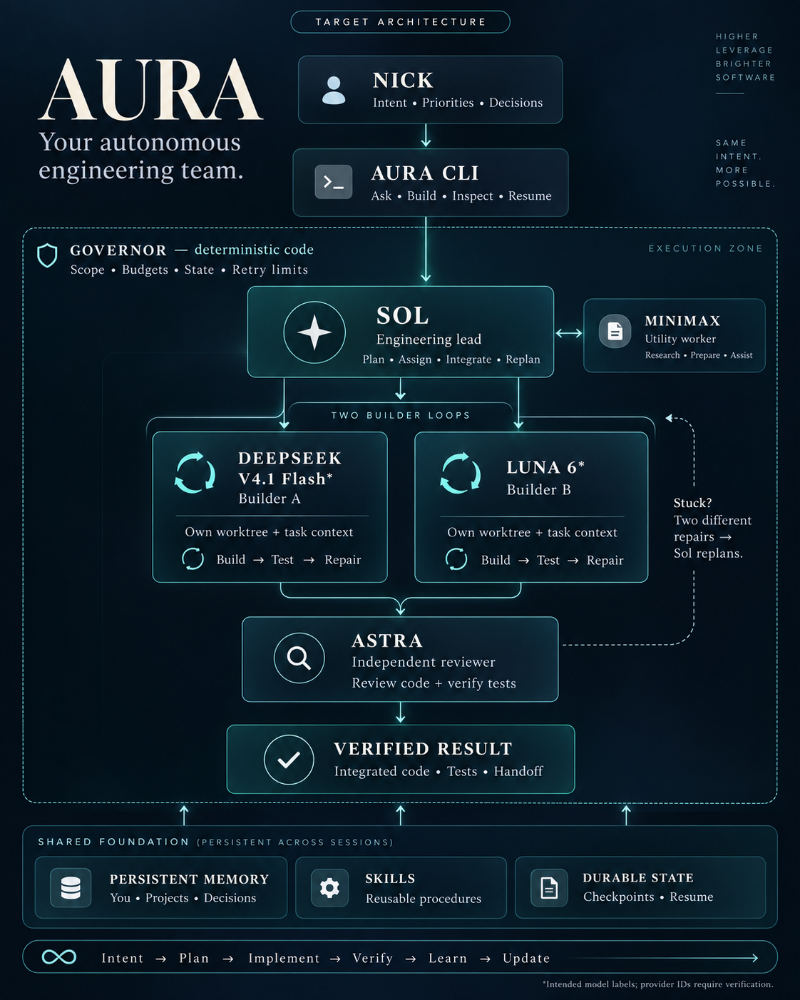

# Aura

Nick Sandoval's personal autonomous coding CLI — his agent team, persistent memory,
skills, and resumable autonomous builds.

**Intent → Plan → Implement → Verify → Learn → Update → Continue**

Sol leads; DeepSeek and Luna build in independent loops; MiniMax supports; Astra audits;
a deterministic Governor controls execution and integration. Both builders share reviewed
lessons while each active slice keeps a stable snapshot.



[Product direction](docs/product/AURA_PRODUCT_DIRECTION.md) · [Builder handoff](docs/product/AURA_BUILDER_HANDOFF.md)

The image describes the target architecture.

## Status

The core governance, recovery, and learning libraries are implemented and tested offline.
The live parallel runner, production review trust, role routing, and measured live learning
still need integration. Exact model IDs and the Luna/Astra audit-policy conflict remain
unresolved. Passing tests is not production readiness.

## Start here

- [Architecture](AURA_ARCHITECTURE.md)
- [Requirements](AURA_PRD.md)
- [Engineering handoff](docs/AURA_HANDOFF.md)
- [Current state](.agent/CURRENT_STATE.md)
- [Finish contract](docs/finish-contract.md)

## Development

Python 3.12 or newer. The distribution is aura-agent; imports and CLI remain `forge`.

```bash
pip install -e ".[dev]"
./scripts/validate.sh
```

Tests use offline transports and simulated proof fixtures. No credentials are needed.
Unrelated products and historical Forge trials are removed from the active tree.
